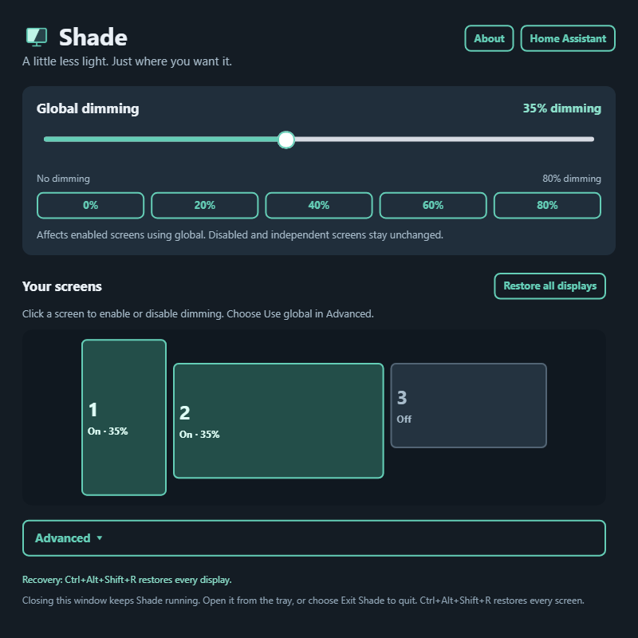
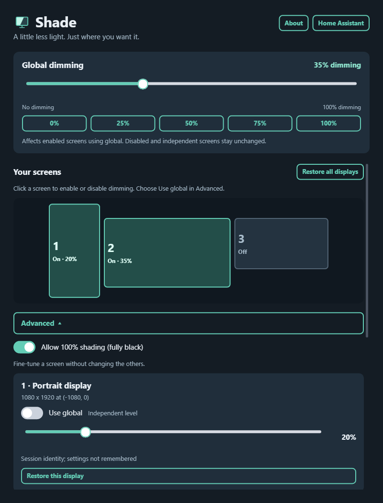
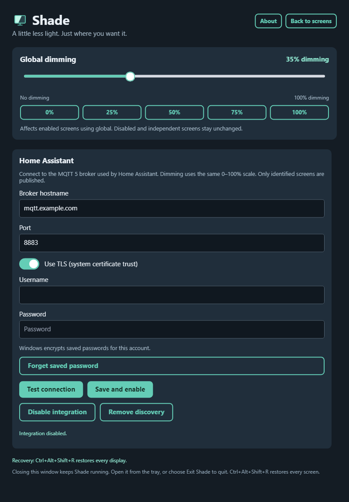

# Shade

A little less light. Just where you want it.

Shade dims individual monitors using a compact interface that mirrors your desktop layout. Built with C#, .NET 10, and CupriFace, with Home Assistant control through MQTT.

**Current version: 1.0.0-rc.2.** Download the Windows x64 candidate from [GitHub Releases](https://github.com/Wixely/Shade/releases). See the [release notes and known limitations](docs/release-1.0.0-rc.2.md).

## Controls

- Click a monitor to enable or disable its shading.
- Use the global slider or quick buttons: **0 / 20 / 40 / 60 / 80%**.
- Expand **Advanced** for individual sliders, **Use global**, and **Allow 100% shading**. Full-shading presets are **0 / 25 / 50 / 75 / 100%**.
- Global changes preserve disabled screens and independent levels.
- Choose **Restore all displays**, or press **Ctrl+Alt+Shift+R** on Windows, to remove shading immediately.
- Closing the Windows control window keeps Shade in the tray. Choose **Exit Shade** to quit and remove all overlays.

## Screenshots

The current CupriFace interface, rendered with sample displays and no saved credentials.



<details>
<summary>Advanced controls — independent levels and optional 100% shading</summary>



</details>

<details>
<summary>Home Assistant — MQTT connection setup</summary>



</details>

## Home Assistant

Open **Home Assistant** in Shade and enter your MQTT 5 broker hostname, port and credentials. Use **Test connection**, then **Save and enable**. TLS uses the system certificate trust store. Switching TLS swaps the standard ports 1883 and 8883 while preserving custom port entries.

Home Assistant discovers a device named **PCNAME Shade**. Per-screen controls use the same screen numbers shown in Shade. Only identified screens are published. Windows protects saved credentials for the current user account.

## Displays and settings

Shade reconciles connected displays and layout changes automatically. Trusted hardware identities retain settings; ambiguous displays can receive an explicit saved identity through Advanced. Identical monitors without unique serials cannot always be distinguished after moving connections.

Windows settings live in `%LOCALAPPDATA%\Shade`. Back up this folder before upgrading. The current settings format is 4. Use `--ephemeral --no-tray` for a test session without loading or saving normal settings. Only one Shade instance runs per desktop session.

## Platform status

Windows is the primary release target. Linux X11 and Wayland backends are implemented, but desktop acceptance is unfinished; no Linux binary is offered for this candidate. Physical display continuity, gaming/HDR/VRR performance, complete Home Assistant lifecycle testing and native text accessibility still have open validation items. See the [release checklist](docs/release-1.0.0-rc.2.md).

## Build and test

Use .NET SDK 10.0.300 (or a compatible 10.0.3xx patch) and Windows PowerShell 5.1:

```powershell
./scripts/restore.ps1
dotnet build Shade.slnx -c Release --no-restore
dotnet run --project src/Shade -c Release --no-build
dotnet run --project tests/Shade.Tests -c Release --no-build -- --mqtt
```

VS Code build/debug configurations are included under `.vscode`. Use Microsoft's C# extension and select **Shade (Windows)** or **Shade (software renderer)**.

Prepare a fresh local Windows candidate:

```powershell
./scripts/prepare-release.ps1
```

The candidate includes a self-contained executable, license, release notes and executable checksum under ignored `artifacts/releases/`. It uses the existing untrimmed single-file baseline; trimming and NativeAOT remain optional experiments. Complete the release-note gates before distribution. The local script never uploads or tags a release. The [release workflow](.github/workflows/release.yml) builds, tests and publishes when a matching version tag is pushed; see [release automation](docs/release-automation.md).

[Cupri screenshot regeneration](docs/images/README.md) uses synthetic displays and no saved credentials. The vendored CupriFace source is pinned and verified during restore; see [dependency provenance](docs/dependencies.md).

## License and development records

Shade's original code and artwork are [MIT licensed](LICENSE). Third-party components retain their respective licenses and notices under `third-party` and in their packages.

Project: [Wixely/Shade](https://github.com/Wixely/Shade). Historical investigation and validation records remain available in [docs](docs/investigation.md), including the [2026-09-11 checkpoint](docs/resume-2026-09-11.md). These retain earlier findings; the current release notes describe the candidate's outstanding work.
